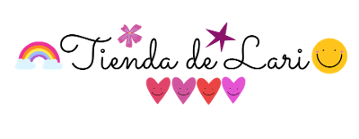

# <em> e-commerce: "Tienda de Lari" </em>

## <em> Proyecto Final del curso de React JS con Vite </em>

## En el proyecto, al tratarse de un e-commerce, se pueden navegar diferentes categorías de productos, seleccionarnos, agregarlos al carrito, quitarlos, generar la compra completando los datos personales requeridos para así generar el ID de la orden que se almacena en Firebase.

### El proyecto se trata de una tienda online para la venta de una línea de productos ilustrados, realizados por una artista visual a quien le apasiona llevar su creatividad y colores a todo tipo de lienzos: tanto físicos como digitales.

### Los diseños son adaptados a distintos productos que comercializa de manera mayorista y minorista en su tienda online: stickers, prints, cuadernos, libretas, llaveros, tote bags pintadas a mano y mucho más!

### Tecnologías utilizadas:

### • React.js
### • react-hook-form
### • react-router-dom
### • context api
### • Firebase / Firestore
### • HTML5
### • css
### • React-Bootstrap
### • Node.js
### • Vite
